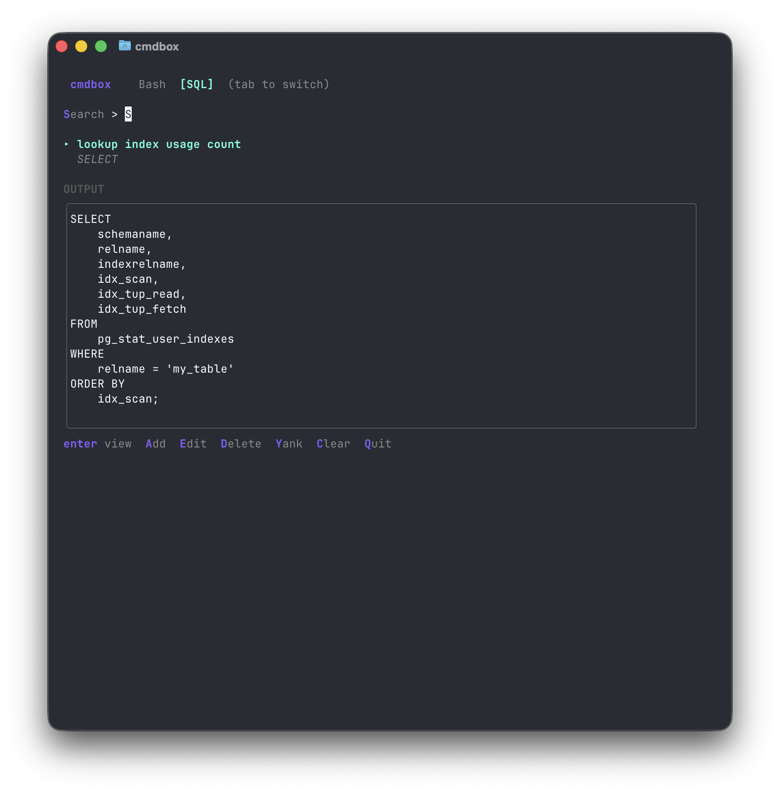

```
 ██████╗███╗   ███╗██████╗ ██████╗  ██████╗ ██╗  ██╗
██╔════╝████╗ ████║██╔══██╗██╔══██╗██╔═══██╗╚██╗██╔╝
██║     ██╔████╔██║██║  ██║██████╔╝██║   ██║ ╚███╔╝
██║     ██║╚██╔╝██║██║  ██║██╔══██╗██║   ██║ ██╔██╗
╚██████╗██║ ╚═╝ ██║██████╔╝██████╔╝╚██████╔╝██╔╝ ██╗
 ╚═════╝╚═╝     ╚═╝╚═════╝ ╚═════╝  ╚═════╝ ╚═╝  ╚═╝
```

A TUI command palette for saving and running shell commands. Store frequently used commands, search them with fuzzy matching, and execute with parameter support.



## Install

```bash
go install .
```

Or build manually:

```bash
go build -o cmdbox .
./cmdbox
```

## Usage

**Controls:**
- `A` - Add command
- `E` - Edit command
- `D` - Delete command
- `Enter` - Run selected command
- `j/k` or arrows - Navigate
- `C` - Clear output
- `Q` - Quit
- Type to search

**Parameters:**

Commands support `{{paramName}}` placeholders that prompt for values at runtime:

```bash
docker build -t {{imageName}} .
ssh {{user}}@{{host}}
```

Use `{{!paramName}}` for sensitive values (won't be remembered).

When running a parameterized command, enter values as `paramName=value` pairs.

## Data

Commands stored in `~/.cmdbox/commands.db` (SQLite).
